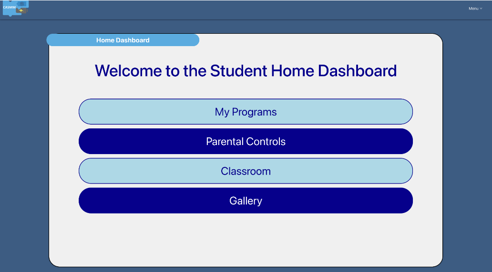
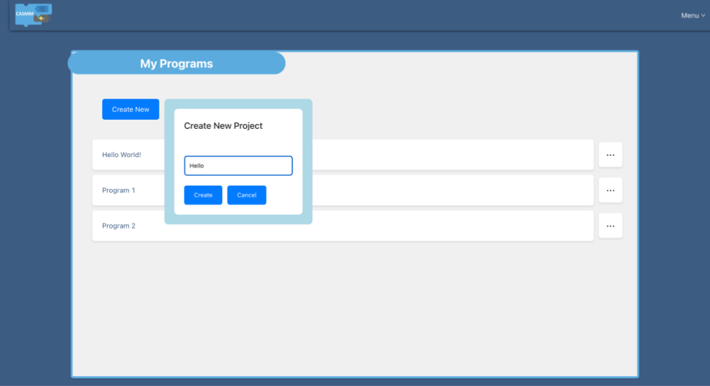
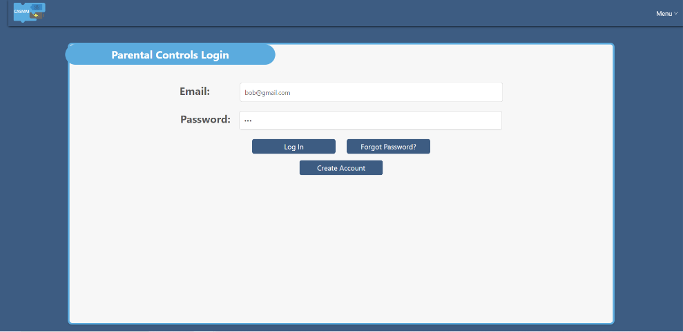
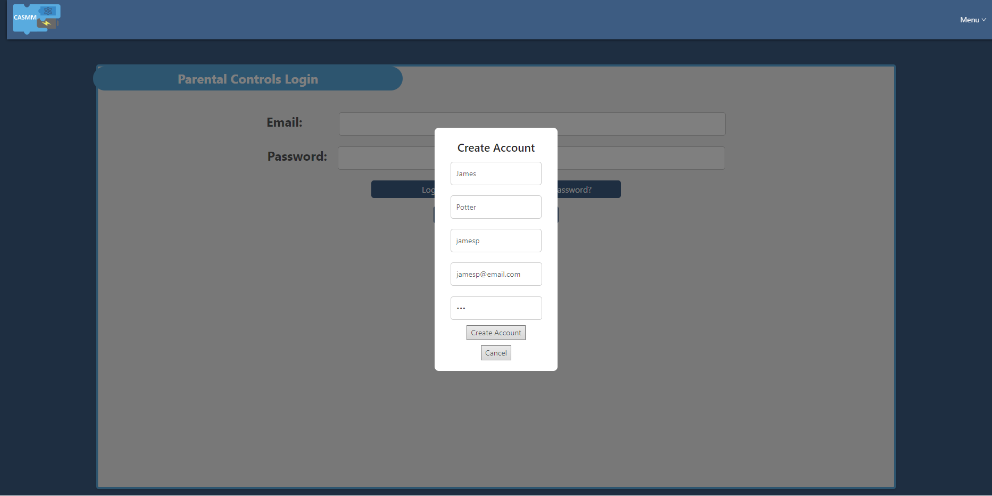
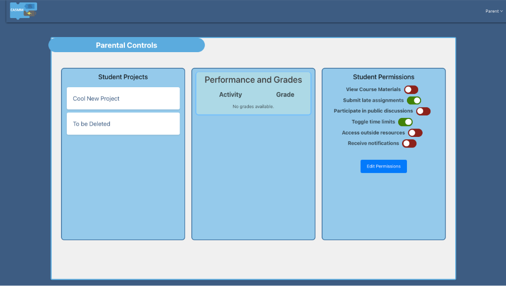
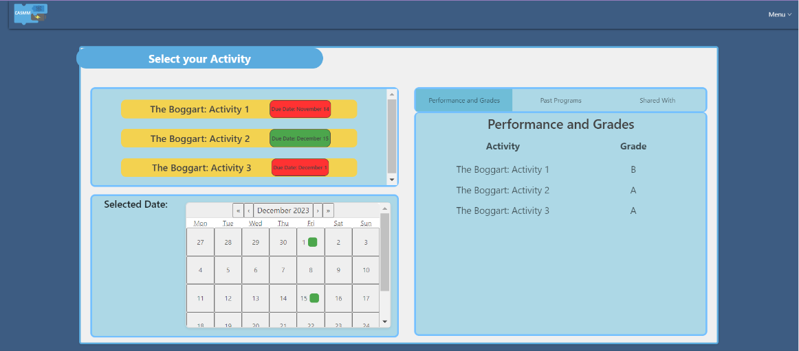
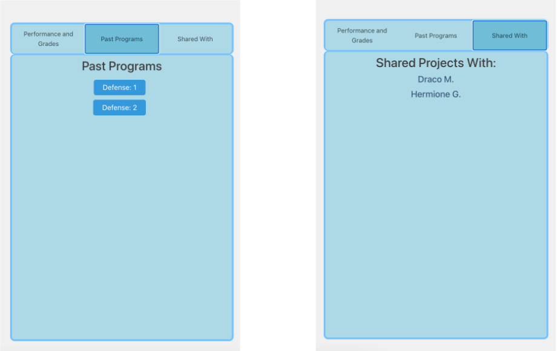
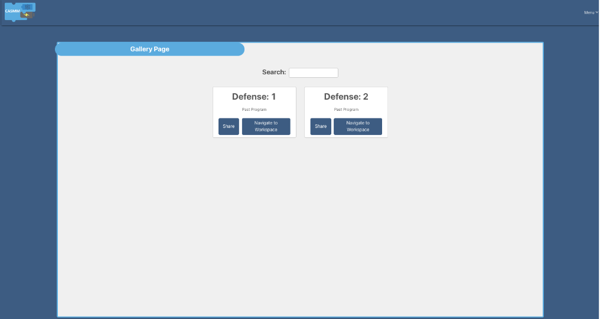

# Project 15 (7a): Student Personal/School Account Dashboards and Parental Controls

### Date Started: 10/24/2023
### Date Delivered: 12/13/20223

### Product Manager: Eesha Shah
### Scrum Master: Carly Solomon
### Development Team:
* Dorian DeJesus
* Tyler Landtroop
* Sebastian Cavallin
* John Fang-Wu
* Aidan Tambling

## Project Features Implemented

### Home Dashboard

The Home Dashboard is where students land upon logging in to their classroom. It provides an interface through which they can access the different components of the model, namely 'My Programs,' 'Parental Controls,' 'Classroom,' and 'Gallery.'

### My Programs

My Programs provides an interface where students can access existing programs and create new ones. Each of these programs is stored in a list, and each can be edited, shared, or deleted. The on-screen display supports both the addition and subtraction of programs via creation and deletion.

### Parental Controls

The Parental Controls Login Page offers parents of students the ability to sign-in on behalf of their children. If the entered email and corresponding password are accurate, the parent can proceed to the Parental Controls Dashboard. Otherwise, they can create a new account or reset their password for a different sign-in opportunity.

Parents have the opportunity, when signed in under their student's account, to create a new parent account through which they can monitor their student. By submitting their name, username, email, and password, a parent can add a new entry into the database which will allow them to log-in in the future.

After logging in with their credentials, the parent enters into this Parental Controls Dashboard. Here, they can monitor their child's projects, track their performance across activities, and alter their student's permissions within the model as a whole.

### Classroom

In the Classroom section, students can keep track of their lessons, activities, grades, and programs. The user-friendly interface shows upcoming assignments, which the integrated calendar displays concurrently. On the right, students can view their performance on previous assignments.

By switching the tab from 'Performance and Grades,' to 'Past Programs' or 'Shared With,' students can view their past programs and keep track of those they have shared projects with.

### Gallery

In the Gallery section, students are presented with an interface through which they can track their projects. To select a project, they can search for a project by name, or simply select it with their mouse. From the project tab, students can share the project with others or navigate to a workspace where they can modify the project.

All of these features are integrated, meaning they work in conjunction with each other. For example, when a student shares a project with another in the Gallery, that student will appear in the Classroom's 'Shared With' tab.

## Instructions for how to run the project locally

### Structure Description

The development environment is composed of five servers. The first one is run with the Create React App dev server. The later four are containerized in Docker and can be run with Docker.
- casmm-client-dev (localhost:3000)
- casmm-server-dev (localhost:1337/admin)
- casmm-compile-dev
- casmm-db-dev (localhost:5432)
- casmm-compile_queue-dev

### Run Instructions

##### casmm-client-dev
1. Change directory to /client
2. If yarn is not installed on your machine, run 'npm install yarn'
3. Run 'yarn start'

##### casmm-server-dev, casmm-compile-dev, casmm-db-dev, casmm-compile_queue-dev
1. Install Docker
2. Open the Docker application
3. Change directory to /server
4. Run 'docker compose up'

Now, you can navigate to localhost:3000 on a web browser and access the project implementation.

## How to update database and server connections

### Updating the database

1. Navigate to localhost:1337/admin
2. Sign-in with the following credentials: 
- email = superadmin@mail.com
- password = TN9q6RZhDaw6
3. Values can be manually added to the fields of any given collection type. 
- For example, the 'Activity' 'The Boggart 3' can be assigned a relevant due date. This value will persist and will display in the student's dashboard.
4. Save any changes made to the database

### Updating the server connections

1. Navigate to /server/api/config/database.js
2. In this file, database connection details can be modified or new connections can be established
3. Save any changes made to the file
4. Test any connection changes to ensure Strapi can still connect to the servers

## Update the database and STRAPI dump files in your file directory

The repository should have up-to-date STRAPI dump files which reflect an updated database.

## Outstanding work

1. 'Forget password' feature for the Parental Controls log-in page is not active. There is a need to incorporate Brevo's cloud email service to implement this functionality.

## Built upon (credit people/organizations you borrowed code from or APIs you used - e.g., Bootstrap, emails, authentication etc)

1. React-Calendar package (npm)